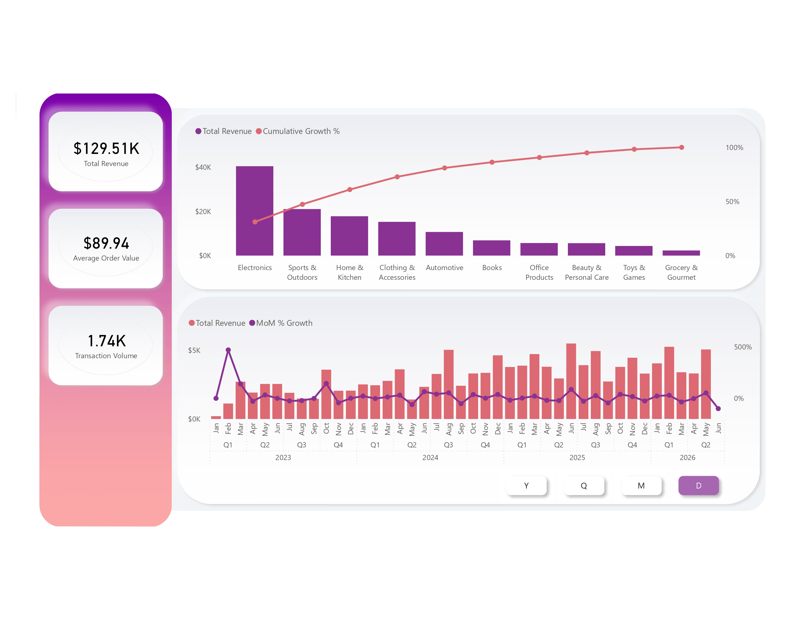
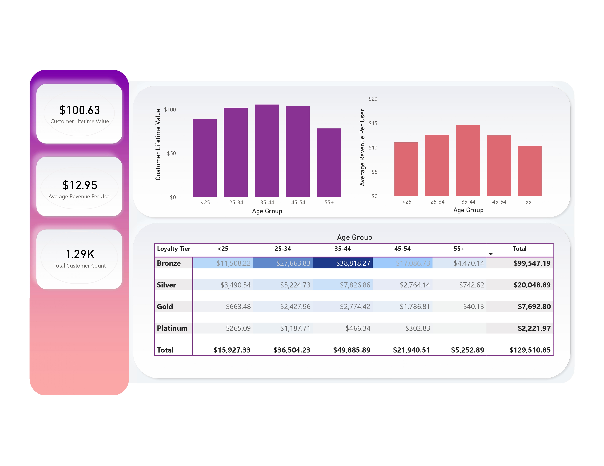
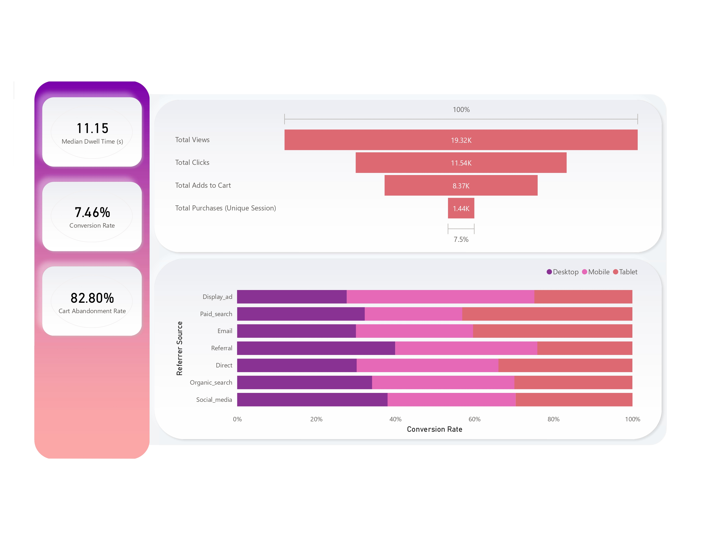
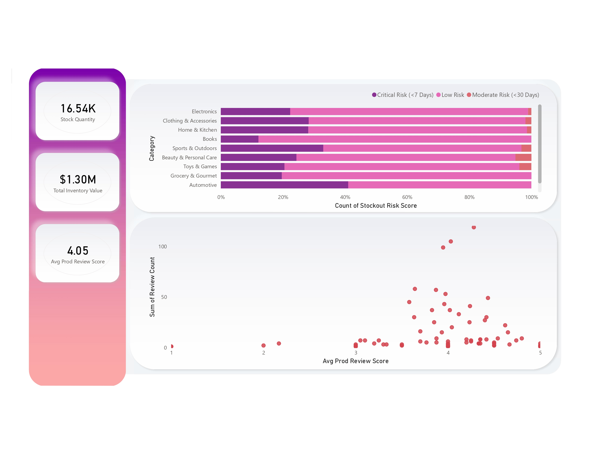
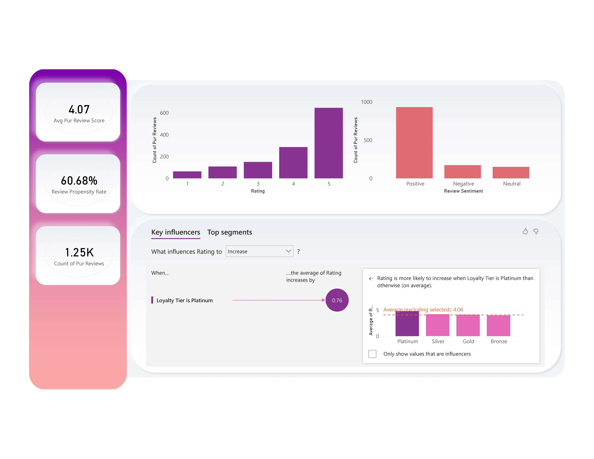

# End-to-end SQL Server Medallion ETL Pipeline with Power BI Executive Analytics

## Executive Summary

This project provides an end-to-end data analytics pipeline that converts raw e-commerce transaction data to an interactive Power BI dashboard to provide executive-level insights into customer behaviour and actionable business intelligence. Implemented using a medallion architecture (Bronze→ Silver→ Gold) in Microsoft SQL Server (T-SQL), the pipeline automates data ingestion, performs robust data quality checks, standardises and transforms raw records, and produces a denormalised semantic layer optimised for reporting and analytics.

The curated Gold layer feeds into an interactive Power BI dashboard to provide executive-level insights into customer behaviour, sales performance, and purchasing patterns. The analysis revealed an 82.80% Cart Abandonment Rate, highlighting a significant conversion opportunity, while identifying customers aged 35–44 as the highest-value segment based on Customer Lifetime Value (CLV).

---

## Tech Stack & Database Architecture

* **Data Source:** Six relational datasets from Kaggle (`users.csv`, `products.csv`, `sessions.csv`, `purchases.csv`, `interactions.csv`, and `reviews.csv`)
* **Database Engine:** Microsoft SQL Server (T-SQL)
* **Business Intelligence:** Power BI Desktop & Power BI Service
* **Data Modeling:** Star Schema, Advanced DAX
* **Core Concepts:** Medallion Architecture, Data Quality Validation, Data Lineage, Financial Reconciliation, Semantic Modeling, AI Key Influencers Analysis

```text
              ┌─────────────────────────────────────────────────────────┐
              │                  RAW KAGGLE CSV FILES                   │
              └────────────────────────────┬────────────────────────────┘
                                           │
                                 [ BULK INSERT (T-SQL) ]
                                           ▼
┌────────────────────────────────────────────────────────────────────────────────────┐
│ BRONZE SCHEMA: Raw Landing Zone                                                    │
│ • Tables: user_info, product_info, session_info, purchase_info,                    │
│   interaction_info, review_info                                                    │
│ • Raw data ingested with permissive data types to maximize load reliability        │
└────────────────────────────────────────┬───────────────────────────────────────────┘
                                         │
                              [ ETL Stored Procedures ]
                                         ▼
┌────────────────────────────────────────────────────────────────────────────────────┐
│ SILVER SCHEMA: Cleansed & Conformed Layer                                          │
│ • Data cleansing (whitespace trimming, null handling, duplicate checks)            │
│ • Multi-format date standardization                                                │
│ • Boolean normalization and ISO-2 country code expansion                           │
│ • Data quality validation and referential integrity enforcement                    │
└────────────────────────────────────────┬───────────────────────────────────────────┘
                                         │
                           [ Star Schema Transformation ]
                                         ▼
┌────────────────────────────────────────────────────────────────────────────────────┐
│ GOLD SCHEMA: Presentation Layer                                                    │
│ • Business-ready reporting tables and semantic model                               │
│ • Pre-aggregated sentiment metrics to eliminate row fan-out                        │
│ • Financial reconciliation against Bronze control totals                           │
└────────────────────────────────────────┬───────────────────────────────────────────┘
                                         │
                           [ Power BI (Import / DirectQuery) ]
                                         ▼
              ┌─────────────────────────────────────────────────────────┐
              │              EXECUTIVE POWER BI DASHBOARDS              │
              │ Revenue │ Conversion Funnel │ Customer Cohorts │        │
              │ Supply Chain Performance │ Customer Lifetime Value      │
              └─────────────────────────────────────────────────────────┘
```

## Phase 1: SQL Server Data Engineering & Medallion Pipeline

### 1. Environment Provisioning & Medallion Schema Setup (`01_database_setup.sql`)

The project kicks off by provisioning a dedicated Microsoft SQL Server database and creating separate Bronze, Silver and Gold schemas. This layered approach helps decouple the different stages of the data lifecycle, from raw ingestion to business-ready reporting, making the overall solution easier to maintain, track and operate, as well as supporting a well-defined ETL pipeline.

### Database Setup DDL

```sql
USE master;
GO

-- State initialization: Ensure clean database execution state
DROP DATABASE IF EXISTS ECommerce;
GO

CREATE DATABASE ECommerce;
GO

USE ECommerce;
GO

-- Provision Medallion Architecture schemas
CREATE SCHEMA Bronze;
GO
CREATE SCHEMA Silver;
GO
CREATE SCHEMA Gold;
GO
```
### 2. Ingestion Staging Tables (`02_bronze_tables.sql`)

The Bronze layer defines the staging tables to which raw data is loaded from the source CSV files. The schema closely follows the source data structure to minimise transformations in the ingestion process and maximise load reliability.

Foreign key constraints are deliberately omitted for efficient bulk loading so that each dataset can be ingested independently before data quality validation and referential integrity checks are applied in the Silver layer. Where appropriate, selected columns are retained with flexible data types to accommodate inconsistencies in the source data without affecting the ingestion process.

```sql
USE ECommerce;
GO

PRINT '>> Tearing down existing Bronze landing tables if they exist...';
DROP TABLE IF EXISTS bronze.review_info;
DROP TABLE IF EXISTS bronze.purchase_info;
DROP TABLE IF EXISTS bronze.interaction_info;
DROP TABLE IF EXISTS bronze.session_info;
DROP TABLE IF EXISTS bronze.product_info;
DROP TABLE IF EXISTS bronze.user_info;
GO

CREATE TABLE bronze.user_info (
    user_id            UNIQUEIDENTIFIER PRIMARY KEY,
    age                INT,
    gender             NVARCHAR(20),
    country            NVARCHAR(150),
    city               NVARCHAR(100),
    signup_date        DATE,
    income_level       NVARCHAR(12),
    preferred_category NVARCHAR(50),
    loyalty_tier       NVARCHAR(15)
);

CREATE TABLE bronze.product_info (
    product_id          UNIQUEIDENTIFIER PRIMARY KEY,
    product_name        NVARCHAR(150),
    product_description NVARCHAR(MAX),
    category            NVARCHAR(100),
    sub_category        NVARCHAR(100),
    brand               NVARCHAR(100),
    price               DECIMAL(10,2) NOT NULL,
    rating_avg          DECIMAL(2,1) DEFAULT 0.0,
    review_count        INT,
    stock_quantity      INT,
    date_added          NVARCHAR(20)
);

CREATE TABLE bronze.session_info (
    session_id      UNIQUEIDENTIFIER PRIMARY KEY,
    user_id         UNIQUEIDENTIFIER,
    start_time      DATETIME2 DEFAULT SYSDATETIME() NOT NULL,
    device_type     NVARCHAR(50),
    referrer_source NVARCHAR(50),
    is_converted    NVARCHAR(10) NOT NULL
);

CREATE TABLE bronze.interaction_info (
    interaction_id   UNIQUEIDENTIFIER PRIMARY KEY,
    user_id          UNIQUEIDENTIFIER,
    product_id       UNIQUEIDENTIFIER,
    session_id       UNIQUEIDENTIFIER,
    interaction_type NVARCHAR(50),
    timestamp        DATETIME2 DEFAULT SYSDATETIME() NOT NULL,
    dwell_time_ms    INT NOT NULL
);

CREATE TABLE bronze.purchase_info (
    purchase_id    UNIQUEIDENTIFIER PRIMARY KEY,
    order_id       UNIQUEIDENTIFIER,
    user_id        UNIQUEIDENTIFIER,
    product_id     UNIQUEIDENTIFIER,
    session_id     UNIQUEIDENTIFIER,
    interaction_id UNIQUEIDENTIFIER,
    quantity       INT,
    unit_price     DECIMAL(10,2) NOT NULL,
    total_amount   DECIMAL(10,2) NOT NULL,
    order_date     DATE
);

CREATE TABLE bronze.review_info (
    review_id     UNIQUEIDENTIFIER PRIMARY KEY,
    user_id       UNIQUEIDENTIFIER,
    product_id    UNIQUEIDENTIFIER,
    purchase_id   UNIQUEIDENTIFIER,
    rating        TINYINT NOT NULL,
    title         NVARCHAR(150),
    review_text   NVARCHAR(MAX),
    review_date   DATETIME2 DEFAULT SYSDATETIME() NOT NULL
);
```
### 3. Automated Bronze Data Ingestion (`03_load_bronze_procedure.sql`)

Data ingestion is completely automated via a reusable stored procedure that refreshes the Bronze layer from the raw CSV files. Each execution truncates the current staging tables before running high-performance BULK INSERT operations, ensuring the landing zone always contains the latest source data.

The procedure also includes structured TRY...CATCH error handling to capture and report ingestion failures without abruptly stopping execution. It also logs the overall load duration, providing basic operational monitoring for each pipeline run.

```sql id="q4r9mc"
CREATE OR ALTER PROCEDURE bronze.load_bronze AS
BEGIN
    DECLARE @start_time DATETIME, @end_time DATETIME;

    BEGIN TRY
        PRINT '--------------------------------------------------';
        PRINT 'Loading Bronze Layer via Bulk Ingestion';
        PRINT '--------------------------------------------------';

        SET @start_time = GETDATE();

        TRUNCATE TABLE Bronze.interaction_info;

        BULK INSERT Bronze.interaction_info
        FROM "D:\SQL, Power BI & Kobo Toolbox\SQL & Power BI Portfolio\raw_data\interactions.csv"
        WITH (
            FIRSTROW = 2,
            FIELDTERMINATOR = ',',
            ROWTERMINATOR = '\n',
            TABLOCK
        );

        -- Repeated ingestion pattern for:
        -- product_info
        -- purchase_info
        -- review_info
        -- session_info
        -- user_info
        --
        -- Additional BULK INSERT options such as
        -- FORMAT = 'CSV' and FIELDQUOTE = '"'
        -- are applied where appropriate.

        SET @end_time = GETDATE();

        PRINT '>> Ingestion completed in '
            + CAST(DATEDIFF(SECOND, @start_time, @end_time) AS NVARCHAR)
            + ' seconds';
    END TRY
    BEGIN CATCH
        PRINT 'ERROR OCCURRED DURING BRONZE LAYER INGESTION';
        PRINT ERROR_MESSAGE();
    END CATCH
END;
GO

EXEC bronze.load_bronze;
```
### 4. Data Quality Audits & Profiling (`04_bronze_quality_checks.sql`)

Before the data is transformed into the Silver layer, the Bronze tables are subjected to a comprehensive set of data quality checks. These validation queries identify data integrity issues, business rule violations, referential inconsistencies, and anomalous values that could affect downstream analytics.

The profiling framework includes financial reconciliation, referential integrity checks, chronological validation, and domain boundary testing to ensure that the source data satisfies critical business and technical quality requirements before transformation.

```sql id="8km4xw"
-- 1. Financial Reconciliation & Business Rule Validation
SELECT DISTINCT total_amount, quantity, unit_price
FROM Bronze.purchase_info
WHERE total_amount <> quantity * unit_price
   OR total_amount <= 0
   OR quantity <= 0
   OR unit_price <= 0;

-- 2. Referential Integrity Audit (Orphan Records)
SELECT COUNT(*) AS orphan_purchase_products
FROM Bronze.purchase_info
WHERE product_id NOT IN (
    SELECT product_id
    FROM Bronze.product_info
);

-- 3. Chronological Validation
SELECT
    p.purchase_id,
    p.order_date,
    u.signup_date
FROM Bronze.purchase_info AS p
JOIN Bronze.user_info AS u
    ON p.user_id = u.user_id
WHERE p.order_date < u.signup_date;

-- 4. Domain Boundary Validation
SELECT user_id, age
FROM Bronze.user_info
WHERE age < 18 OR age > 100;

SELECT review_id, rating
FROM Bronze.review_info
WHERE rating < 1 OR rating > 5;
```
### 5. Silver Layer Schema & Transformation Pipeline (`05_silver_tables.sql` & `06_load_silver_procedure.sql`)

The Silver layer transforms raw Bronze data into standardised, analytics-ready datasets. In this layer, the ETL pipeline cleanses data, normalises types, and standardises values while preserving business meaning. 

Key transformations include trimming inconsistent whitespace, parsing multiple date formats into a common SQL DATE type, normalising text casing, converting textual Boolean values into standardised binary indicators (0/1), and expanding ISO country codes into full country names. These transformations improve data consistency and prepare the datasets for downstream reporting and dimensional modelling.

```sql id="hj1d5r"
-- Silver target table
CREATE TABLE silver.session_info (
    session_id      UNIQUEIDENTIFIER PRIMARY KEY,
    user_id         UNIQUEIDENTIFIER,
    start_time      DATETIME2,
    device_type     NVARCHAR(50),
    referrer_source NVARCHAR(50),
    is_converted    INT -- Standardized Boolean indicator (0/1)
);
GO

CREATE OR ALTER PROCEDURE silver.load_silver AS
BEGIN
    BEGIN TRY

        -- 1. Trim whitespace from transactional attributes
        TRUNCATE TABLE silver.interaction_info;

        INSERT INTO silver.interaction_info
        SELECT
            interaction_id,
            user_id,
            product_id,
            session_id,
            TRIM(interaction_type),
            timestamp,
            dwell_time_ms
        FROM bronze.interaction_info;

        -- 2. Standardize multiple source date formats
        TRUNCATE TABLE silver.product_info;

        INSERT INTO silver.product_info
        SELECT
            product_id,
            TRIM(product_name),
            TRIM(product_description),
            TRIM(category),
            TRIM(sub_category),
            TRIM(brand),
            price,
            NULLIF(rating_avg, 0.0),
            review_count,
            stock_quantity,
            COALESCE(
                TRY_CONVERT(DATE, TRIM(date_added), 120),
                TRY_CONVERT(DATE, TRIM(date_added), 105),
                TRY_CONVERT(DATE, TRIM(date_added), 1)
            )
        FROM bronze.product_info;

        -- 3. Normalize text casing and Boolean values
        TRUNCATE TABLE silver.session_info;

        INSERT INTO silver.session_info
        SELECT
            session_id,
            user_id,
            start_time,
            CONCAT(
                UPPER(SUBSTRING(TRIM(device_type),1,1)),
                LOWER(SUBSTRING(TRIM(device_type),2,LEN(device_type)))
            ),
            CONCAT(
                UPPER(SUBSTRING(TRIM(referrer_source),1,1)),
                LOWER(SUBSTRING(TRIM(referrer_source),2,LEN(referrer_source)))
            ),
            CASE
                WHEN LOWER(TRIM(is_converted)) = 'true' THEN 1
                WHEN LOWER(TRIM(is_converted)) = 'false' THEN 0
                ELSE NULL
            END
        FROM bronze.session_info;

        -- 4. Expand ISO country codes
        TRUNCATE TABLE silver.user_info;

        INSERT INTO silver.user_info
        SELECT
            user_id,
            age,
            TRIM(gender),
            CASE UPPER(TRIM(country))
                WHEN 'DE' THEN 'Germany'
                WHEN 'IN' THEN 'India'
                WHEN 'GB' THEN 'United Kingdom'
                WHEN 'US' THEN 'United States'
                -- Additional ISO-2 mappings implemented
                ELSE TRIM(country)
            END,
            city,
            signup_date,
            TRIM(income_level),
            TRIM(preferred_category),
            CONCAT(
                UPPER(SUBSTRING(TRIM(loyalty_tier),1,1)),
                LOWER(SUBSTRING(TRIM(loyalty_tier),2,LEN(loyalty_tier)))
            )
        FROM bronze.user_info;

    END TRY
    BEGIN CATCH
        DECLARE @ErrorMessage NVARCHAR(4000) = ERROR_MESSAGE();
        RAISERROR(@ErrorMessage, 16, 1);
    END CATCH
END;
GO

EXEC silver.load_silver;
```
### 6. Gold Semantic Consolidation Layer (`07_gold_consolidation_view.sql`)

The Gold layer is a denormalised semantic view that brings together customer, product, session, interaction, purchase, and review data into one analytics-ready dataset for business intelligence reporting.

Customer reviews are pre-aggregated before joining the transactional data to maintain row-level integrity. This prevents row fan-out (where one row expands into many), ensuring that important measures like revenue, interactions, and conversion rates stay accurate while still including insights from reviews.

```sql id="oq7m2a"
CREATE OR ALTER VIEW gold.vw_ecommerce_behavior_analytics AS
SELECT
    i.interaction_id      AS Interaction_ID,
    i.interaction_type    AS Interaction_Type,
    i.timestamp           AS Interaction_Time,
    i.dwell_time_ms       AS Dwell_Time_MS,

    s.session_id          AS Session_ID,
    s.device_type         AS Device_Type,
    s.referrer_source     AS Referrer_Source,

    u.user_id             AS User_ID,
    u.country             AS Country,
    u.loyalty_tier        AS Loyalty_Tier,

    p.product_id          AS Product_ID,
    p.product_name        AS Product_Name,
    p.category            AS Product_Category,

    pr.purchase_id        AS Purchase_ID,
    pr.quantity           AS Quantity,
    pr.unit_price         AS Unit_Price,
    pr.total_amount       AS Purchase_Amount,

    r.Review_ID           AS Review_ID,
    r.Review_Rating       AS Review_Rating

FROM Silver.interaction_info AS i

LEFT JOIN Silver.session_info AS s
    ON i.session_id = s.session_id

LEFT JOIN Silver.user_info AS u
    ON i.user_id = u.user_id

LEFT JOIN Silver.product_info AS p
    ON i.product_id = p.product_id

LEFT JOIN Silver.purchase_info AS pr
    ON i.interaction_id = pr.interaction_id

LEFT JOIN (
    SELECT
        user_id,
        product_id,
        MAX(review_id) AS Review_ID,
        AVG(CAST(rating AS DECIMAL(3,2))) AS Review_Rating
    FROM Silver.review_info
    GROUP BY user_id, product_id
) AS r
    ON i.user_id = r.user_id
   AND i.product_id = r.product_id;
GO
```
### 7. Gold Layer Validation & Financial Reconciliation (`08_gold_quality_checks.sql`)

Validation queries are run on the Gold layer before reporting to ensure no data loss, duplication, or changes occurred during transformation by comparing financial totals and record counts.

These quality assurance checks compare the source data in Bronze with the Gold layer's semantic view to ensure that revenue totals and interaction counts remain consistent after multiple table joins.

```sql id="x9e4pv"
-- 1. Revenue Reconciliation
SELECT
    (SELECT SUM(total_amount)
     FROM bronze.purchase_info) AS Source_Purchase_Total,

    (SELECT SUM(Purchase_Amount)
     FROM gold.vw_ecommerce_behavior_analytics) AS Gold_Consolidated_Total,

    CASE
        WHEN
            (SELECT SUM(total_amount) FROM bronze.purchase_info)
            =
            (SELECT SUM(Purchase_Amount) FROM gold.vw_ecommerce_behavior_analytics)
        THEN 'PASSED: Revenue totals fully reconciled.'
        ELSE 'FAILED: Revenue mismatch detected.'
    END AS Revenue_Reconciliation_Status;


-- 2. Record Count Reconciliation
SELECT
    (SELECT COUNT(*)
     FROM bronze.interaction_info) AS Raw_Bronze_Rows,

    (SELECT COUNT(*)
     FROM gold.vw_ecommerce_behavior_analytics) AS Final_Gold_Rows,

    CASE
        WHEN
            (SELECT COUNT(*) FROM bronze.interaction_info)
            =
            (SELECT COUNT(*) FROM gold.vw_ecommerce_behavior_analytics)
        THEN 'PASSED'
        ELSE 'FAILED'
    END AS Data_Retention_Status;
```
## Phase 2: Power BI Business Intelligence & Strategic Insights

The Power BI reporting layer directly connects to the Gold semantic view, transforming curated transactional data into interactive dashboards to drive business analysis across five key domains.

### 1. Revenue Performance & Product Category Analysis

**Business Overview**

* **Total Revenue:** **$129.51K**
* **Total Transactions:** **1.74K**
* **Average Order Value (AOV):** **$89.94**

**Top Revenue Category**

The top product category in the Pareto analysis is Electronics, which contributes the highest revenue to the total revenue and is the main driver of revenue for the business.

**Revenue Trend Analysis**

Month-over-Month (MoM) analysis indicates strong revenue growth in early 2023 with relatively stable performance with recurring seasonal peaks in 2024 and 2025.

***Figure 1: Executive dashboard summarizing revenue, sales trends, and category performance***



---

### 2. Customer Demographics & Loyalty Analysis

**Highest-Value Customer Segment**

The most valuable customers are those aged 35-44, with the highest Customer Lifetime Value (CLV) and Average Revenue Per User (ARPU).

**Revenue Distribution by Loyalty Tier**

Bronze customers are the largest segment in terms of revenue ($99.54K) because they are the largest customer segment, but Gold and Platinum customers spend more per customer.

***Figure 2: Customer demographics, loyalty segmentation, and Customer Lifetime Value (CLV) analysis***



---

### 3. Customer Behavior & Conversion Funnel Analysis

**Conversion Funnel**

Customer interactions progress through the following stages:

* **Views:** 19.32K
* **Clicks:** 11.54K
* **Add to Cart:** 8.37K
* **Session Conversion Rate:** 7.46%

The analysis shows a Cart Abandonment Rate of 82.80% meaning that cart abandonment is the main reason for lost conversions and a major opportunity for increased revenue.

**Traffic Source Performance**

Referral traffic converts better on mobile and tablet devices than traditional display advertising channels, suggesting opportunities to optimize marketing spend.

***Figure 3: Customer journey from product views to completed purchases, highlighting the 82.80% cart abandonment rate***



---

### 4. Inventory & Product Availability

Automotive and Sports & Outdoors are in fact the most exposed relative to their catalogue sizes, with critical stockout risks (< 7 days) affecting 41% and 33% of their catalogues, respectively. Clothing & Accessories are close behind at roughly 28%, and Electronics is lower at about 22% critical risk. 

However, Electronics generates the highest revenue; therefore, it is vital to maintain adequate inventory levels to support sales performance.

***Figure 4: Inventory levels, product availability, and stockout risk across product categories***



---

### 5. Product Reviews & Customer Advocacy

**Customer Satisfaction**

Products have an average review rating of 4.05/5 from 1.25K customer reviews, showing excellent customer satisfaction.

**AI Key Influencers Analysis**

The AI Key Influencers visual in Power BI also shows that customers in the Platinum loyalty tier are rated 0.76 higher in review ratings compared to customers in all other tiers, indicating a positive correlation between loyalty status and customer advocacy.

***Figure 5: Product review analysis, customer satisfaction metrics, and AI Key Influencers results***



---

## Business Recommendations

### Improve Checkout Conversion

Automate abandoned cart emails, personalised remarketing campaigns and checkout experience improvements to reduce Cart Abandonment Rate. Even small improvements in checkout completion rate can lead to significant revenue growth.

### Strengthen Inventory Planning

Focus on restocking items identified as Critical Stockout Risk, particularly in the Electronics category, to safeguard the company’s primary source of revenue.

### Expand High-Value Customer Loyalty

Personalised promotions and loyalty incentives to encourage Bronze tier customers aged 35 to 44 to move into higher tiers of membership, increasing long-term customer lifetime value.

---

## 📁 Repository Structure

```text
sql-powerbi-ecommerce-analytics/
│
├── 📂 Data/
│   └── Raw Kaggle source datasets
│
├── 📂 SQL Scripts/
│   ├── Database setup scripts
│   ├── Bronze layer (staging tables & bulk loading)
│   ├── Silver layer (data cleansing & transformation)
│   ├── Gold layer (semantic view & reporting)
│   └── Data quality validation scripts
│
├── 📂 Chart_Images/
│   └── Power BI dashboard screenshots
│       ├── overview.jpg
│       ├── demographic.jpg
│       ├── conversion.jpg
│       ├── inventory.jpg
│       └── review.jpg
│
├── 📄 README.md
│   └── Project documentation
│
├── 📄 ECommerce_Analytics.pbix
│   └── Interactive Power BI dashboard
│
├── 📄 Charts.pdf
   └── Executive dashboard report

```
